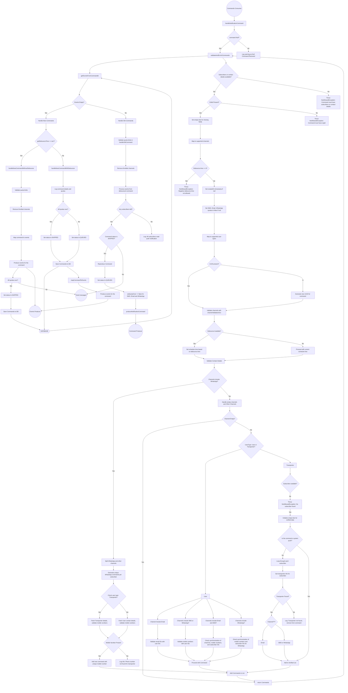
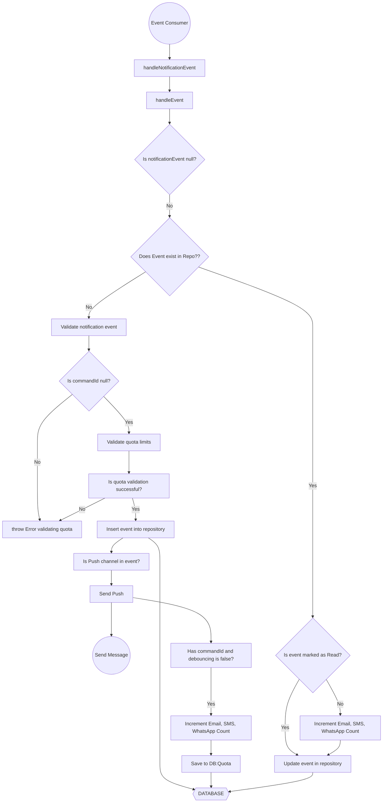
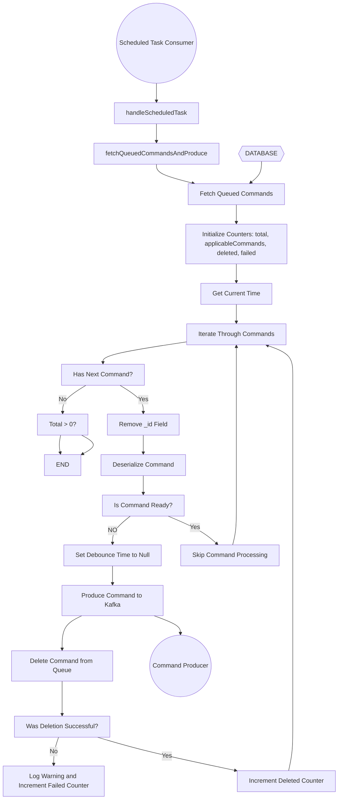

# Command Consumer

```mermaid
   flowchart
    CC((Commands Consumer)) --> B[handleNotificationCommand]
    B --> C{command Null?}
    C -- Yes --> D[validateAndEnrichCommands]
    C -- No --> E[Log warning as Null Command Recieved]
    D --> F[getEventsFromCommandId]
    F --> G{Events Empty?}
    G -- Yes --> H[Handle New Commands]
    G -- No --> I[Handle Old Commands]
    D --> D1{Subscribers or contact details available?}
    D1 -- Yes --> D2{OrdId Present?}
    D1 -- No --> D3[Throw NotAllowedException: Command must have subscribers or contact details]
    D2 -- Yes --> D4[Set empty lists for missing fields]
    D2 -- No --> D5[Throw NotAllowedException: Command must have orgId]
    D4 --> D6[Map to supported channels]
    D6 --> D7{Debounce time <= 0?}
    D7 -- Yes --> D8[Throw NotAllowedException: Negative debounce time not allowed]
    D7 -- No --> D9[Set createdOn timestamp if null]
    D9 --> D10[Set SMS, Email, WhatsApp quotas to false if null]
    D10 --> D11[Map to supported user types]
    D11 --> D12{UUID present?}
    D12 -- Yes --> D13[Validate channels with channelValidationSvc]
    D12 -- No--> D14[Generate new UUID for command]
    D14 --> D13
    D13 --> D15{Debounce Available?}
    D15 -- Yes --> D16[Set schedule time based on debounce time]
    D15 -- No --> D17[Proceed with current schedule time]
    D16 --> J[Validate Contact Details]
    D17 --> J
    J --> J1{Channels Include WhatsApp?}
    J1 -- Yes --> J2[Split WhatsApp and other channels]
    J2 --> J3[Generate unique WhatsApp commands per subscriber]
    J3 --> J4{Check user type: Transporter?}
    J4 -- Yes --> J5[Fetch Transporter details, validate mobile numbers]
    J4 -- No --> J6[Fetch User contact details, validate mobile numbers]
    J5 --> J7{Mobile Number Present}
    J6 --> J7
    J7 -- Yes --> J8[Add new command with unique mobile number]
    J7 -- No --> J9[Log info: Phone number not found for transporter]
    J8 --> K[Add Commands to List]
    K --> L[return Commands]
    J1 -- No --> J10[Handle empty channels and Other Channels]
    J10 --> J11{Channel Empty?}
    J11 -- Yes --> L
    J11 -- No -->  J12{UserType: User or Transporter?}
    J12 --> J13[User]
    J13 --> J14[Channel Include Email]
    J13 --> J15[Channels include SMS or WhatsApp?]
    J13 --> J16[Channels include Email and SMS?]
    J13 --> J17[Channels include WhatsApp?]
    J14 --> J18[Validate email IDs with user IDs]
    J15 --> J19[Validate mobile numbers with user IDs]
    J16 --> J20[Check synchronization of email IDs, mobile numbers, and subscriber IDs]
    J17 --> J21[Check synchronization of mobile numbers and subscriber IDs for WhatsApp]
    J18 --> J22[Proceed with Command]
    J19 --> J22
    J20 --> J22
    J21 --> J22
    J22 --> K
    J12 --> J23[Transporter]
    J23 --> J24{Subscriber available?}
    J24 -- No --> J25[Throw NotAllowedException: No subscriber found]
    J25 -- Yes --> J26[Initialize empty lists for verified data]
    J26 --> J27{Is the command a system push?}
    J27 -- No --> J28[Loop through each subscriber]
    J28 --> J29[Get transporter info for subscriber]
    J29 --> J30{Transporter Found?}
    J30 -- Yes --> J31{Channel???}
    J30 -- No --> J32[Log: Transporter not found, remove from command]
    J31 --> J33[Email]
    J31 --> J34[SMS or WhatsApp]
    J33 --> J35[Add to Verified List]
    J34 --> J35
    J27 -- Yes --> J35
    J35 --> K
    L --> D
    I --> I1[Validate quota limits in handleOldCommand]
    I1 --> I2[Remove throttled channels]
    I2 --> I3[Process events from debounced command]
    I3 --> I4{Any subscribers left?}
    I4 -- Yes --> I5{Command status is SKIPPED?}
    I4 -- No --> I6[Log: All subscribers read push notification]
    I5 -- Yes --> M[Reproduce Command]
    I5 -- No --> SM((Send messages))
    M --> M1[Set status to QUEUED]
    M1 --> M2[setQuotaOver == false for SMS, Email and WhatsApp]
    M2 --> M3[produceNotificationCommand]
    M3 --> CP((Command Producer))
    H --> H1{getDebounceTime == null ?}
    H1 -- Yes --> N[handleNewCommandWithoutDebounce]
    H1 -- No --> O[handleNewCommandWithDebounce]
    N --> N1[Validate quota limits] --> N2[Remove throttled channels] --> N3[Map command to events] --> N4[Produce events for the command] --> N5[All quotas over?]
    N5 -- Yes --> N6[Set status to SKIPPED]
    N5 -- No --> SM
    N6 --> N7[Save Commands to DB]
    N7 --> DB{{DATABASE}}
    N4 --> EP((Events Producer))
    DB --> F
    O --> O1[Log command details and quotas] --> O2{All quotas over?}
    O2 -- Yes --> O3[Set status to SKIPPED] --> O5[Save Commands to DB] --> DB
    O2 -- No --> O4[Set status to QUEUED] --> O5
    O5 --> O6[mapCommandToEvents] --> O7[Produce events for the command]
    O7 --> EP
```
# Event Consumer

```mermaid
   flowchart
    EC((Event Consumer)) --> P[handleNotificationEvent] --> P1[handleEvent] --> P2{Is notificationEvent null?} -- No --> P3{Does Event exist in Repo??}
    P3 -- No --> P4[Validate notification event] --> P5{Is commandId null?}
    P5 -- No --> P6[throw Error validating quota]
    P5 -- Yes --> P7[Validate quota limits] --> P8[Is quota validation successful?] -- Yes --> P9[Insert event into repository] --> DB{{DATABASE}}
    P8 -- No --> P6
    P9 --> P10[Is Push channel in event?] --> P11[Send Push] --> SM((Send Message))
    P11 --> P12[Has commandId and debouncing is false?] -- Yes --> P13[Increment Email, SMS, WhatsApp Count] --> P14[Save to DB:Quota] --> DB
    P3 -- Yes --> P15{Is event marked as Read?}
    P15 -- Yes --> P16[Update event in repository]
    P15 -- No --> P17[Increment Email, SMS, WhatsApp Count] --> P16 --> DB
```
# Schedule Task Consumer

```mermaid
   flowchart
   STC((Scheduled Task Consumer)) --> Q[handleScheduledTask] --> Q1[fetchQueuedCommandsAndProduce] --> Q2[Fetch Queued Commands] --> Q3[Initialize Counters: total, applicableCommands, deleted, failed] --> Q4[Get Current Time] --> Q5[Iterate Through Commands] --> Q6[Has Next Command?]
   DB{{DATABASE}} --> Q2
   Q6 -- Yes --> Q7[Remove _id Field]
   Q6 -- No --> Q8[Total > 0?] --> Q9[Log Summary: Total, Expired, Updated, Failed]
   Q8 --> Q9[END]
   Q7 --> Q10[Deserialize Command] --> Q11[Is Command Ready?] -- NO --> Q12[Set Debounce Time to Null] --> Q13[Produce Command to Kafka] --> Q14[Delete Command from Queue] --> Q15[Was Deletion Successful?] -- No --> Q18[Log Warning and Increment Failed Counter]
   Q15 -- Yes --> Q16[Increment Deleted Counter] --> Q5
   Q11 -- Yes --> Q17[Skip Command Processing] --> Q5
   Q13 --> CP((Command Producer))
```
