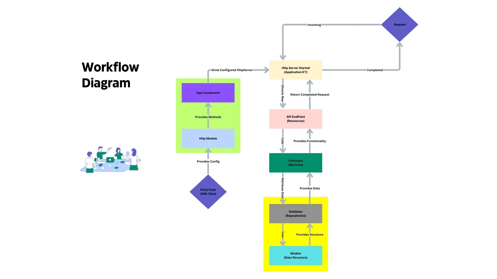

# Project: Documentation for Newly Boarding Members

### XML Files

**What are XML Files?**  
XML (Extensible Markup Language) is a structured format used to store data in a way that both humans and machines can read. In our project, XML files are mainly used to store application settings, like database details, service URLs, and other configurations.

**Why do we need XML files?**  
Instead of hardcoding important values (like database names or server addresses) directly into the code, XML files allow us to separate these configurations. This way, if we need to update or change these values, we only need to edit the XML file instead of modifying the code. This helps in maintaining flexibility and preventing errors in different environments (like production or testing).

---

**Example XML File**:

```xml
<?xml version='1.0' encoding='UTF-8'?>
<properties>
    <!-- Application Configuration -->
    <entry key="registry.manager.app.ip">http://0.0.0.0</entry>
    <entry key="registry.manager.app.port">8087</entry>

    <!-- Database Configuration -->
    <entry key="registry.manager.db.name">registry</entry>
    <entry key="registry.manager.db.host">mongo-registry.databases</entry>
    <entry key="registry.manager.db.port">27017</entry>

    <!-- Service URLs -->
    <entry key="gps.processor.service.url">http://position-processor.streams:2121</entry>
</properties>
```

This XML file contains:
- **Application Configuration**: Stores the IP and port of the application (`registry.manager.app.ip` and `registry.manager.app.port`).
- **Database Configuration**: Defines the database name, host, and port (`registry.manager.db.name`, `registry.manager.db.host`, `registry.manager.db.port`).
- **Service URLs**: Holds the URL for a GPS processor service (`gps.processor.service.url`).

By defining these values in the XML file, you can easily update them without altering your code. If the application server’s IP changes, you just edit the XML file instead of touching the codebase.

---

### XML Overriding

**What is XML Overriding?**  
XML overriding is used when we have multiple environments (like production and testing) that need different settings. For example, your production database might be on a secure cloud server, while your test database could be on your local machine. To handle these differences, we create separate XML files for each environment.

**How does it work?**  
Imagine you have two files: `Production.xml` for your live environment and `Test.xml` for your testing environment. Both files have the same structure, but they contain different values based on the environment they’re used in.

When you run the application in the **production environment**, it will load `Production.xml`, and when you run it in the **testing environment**, it will load `Test.xml`, overriding the settings from the base configuration.

---

**Detailed Example**:

```xml
<!-- Production.xml -->
<properties>
    <entry key="registry.manager.app.ip">http://prod-server.com</entry>
    <entry key="registry.manager.db.host">mongo-prod.databases</entry>
    <entry key="registry.manager.db.port">27017</entry>
</properties>
```

```xml
<!-- Test.xml -->
<properties>
    <entry key="registry.manager.app.ip">http://test-server.com</entry>
    <entry key="registry.manager.db.host">mongo-test.databases</entry>
    <entry key="registry.manager.db.port">27018</entry>
</properties>
```

Let’s break it down:

- **Production.xml**:
  - The application will run using the IP `http://prod-server.com` and connect to the production MongoDB instance located at `mongo-prod.databases` on port `27017`.
  
- **Test.xml**:
  - In the test environment, the application will instead use the IP `http://test-server.com` and connect to the test MongoDB instance at `mongo-test.databases` on port `27018`.

**How does this help?**
- **Easier Environment Management**: You don’t have to change code every time you move between environments. Just select the right XML file for the environment you're in.
- **Safer Deployments**: By keeping production and test settings in separate files, you avoid using test configurations (like a local database) in production by accident.
- **Flexibility**: You can add as many environment-specific XML files as you need, e.g., `Staging.xml`, `Development.xml`, etc.

**Real-Life Example**:  
Think of this like having two different sets of keys for your car: one for weekdays (when you need access to work) and another for weekends (when you only need access to home). The car remains the same, but the keys (configuration) change based on your schedule (environment). Similarly, the application remains the same, but the configuration file changes based on whether it's in production or test mode.

---

Let's dive deeper into the explanation of each part of the project structure, followed by the flowchart that includes an example.

---

### Project Structure

1. **DI (Dependency Injection) - Example: HTTP Module with GrizzlyServer**  
   Dependency Injection (DI) is a design pattern used to pass the dependencies (like services or repositories) into classes rather than having them instantiate these dependencies themselves. It helps in decoupling components and making them easier to test and manage.

   In our project, we use DI to inject dependencies like the HTTP server (GrizzlyServer) and other services into our resource files. For example, when starting the **GrizzlyServer** (our HTTP module), it injects resources (API endpoints), services, and repositories, making them available to handle requests.

   **Real-world example**:  
   Imagine an online shopping app where different sections (like user authentication, product listing, and payment processing) need different functionalities (services). DI is like giving each section the necessary tools it needs to perform its job without each section worrying about how to get those tools.

---

2. **Registering Resources**  
   Resources in the project are like doors to specific parts of the system. Each resource is tied to a particular API endpoint (e.g., `/vehicles`, `/users`). This registration step maps URLs to the resource classes that will handle requests.

---

3. **Resource Files**  
   Resource files contain the logic for handling specific API requests. Each resource file corresponds to a particular resource or endpoint. For example, a `VehicleResource` file could manage requests related to vehicles, while a `UserResource` could handle user-related requests. These resource files call services to perform the actual operations.

   **Example**:  
   - `VehicleResource`: Handles `/vehicles` requests.
   - `UserResource`: Handles `/users` requests.

---

4. **Services**  
   Services contain the core business logic of the application. When resource files receive requests, they call services to perform operations like checking data validity, updating records, or interacting with external APIs.

   **Example**:  
   A `DocumentService` might validate whether a vehicle's document is expired, interact with external services (like the mParivahan API), and return the result.

---

5. **Repositories**  
   Repositories are responsible for interacting with the database. They handle data retrieval, updates, and persistence. Services depend on repositories to fetch or save data.

   **Example**:  
   A `VehicleRepository` would handle database operations like fetching vehicle data or saving new vehicles.

---

6. **Model**  
   Models represent the data structure used throughout the project. They define how data is stored in the database and how it is transferred between different layers.

   **Example**:  
   A `Vehicle` model would define fields like `vehicleId`, `registrationNumber`, and `documentExpiryDate`. This model would be used by both repositories and services.

---



