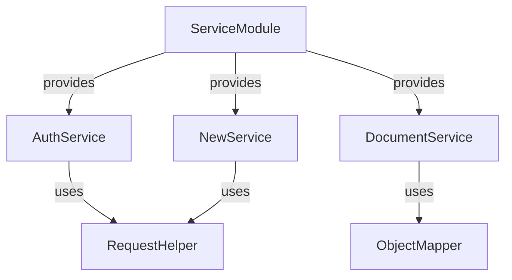

Here’s a detailed documentation in GitHub Markdown format, explaining how the XML and Dependency Injection (DI) work based on the provided code. This documentation includes explanations, code examples, and a diagram to illustrate the DI process.

---

# Project Documentation

## Overview

This documentation provides a detailed explanation of the Dependency Injection (DI) setup and how XML configuration works within our application. It aims to help new members onboard smoothly and understand the architecture of the project.

## Table of Contents

- [1. What is Dependency Injection?](#1-what-is-dependency-injection)
- [2. Why Use Dependency Injection?](#2-why-use-dependency-injection)
- [3. Dependency Injection in This Project](#3-dependency-injection-in-this-project)
- [4. Understanding the Code](#4-understanding-the-code)
  - [4.1. Service Module](#41-service-module)
  - [4.2. Provider Methods](#42-provider-methods)
- [5. XML Configuration](#5-xml-configuration)
- [6. How to Add a New Service](#6-how-to-add-a-new-service)
- [7. Diagram of Dependency Injection](#7-diagram-of-dependency-injection)
- [8. Conclusion](#8-conclusion)

---

## 1. What is Dependency Injection?

Dependency Injection is a design pattern used to implement IoC (Inversion of Control), allowing for more modular and testable code. Instead of a class instantiating its dependencies directly, they are provided (or "injected") from an external source.

### Key Benefits:
- **Loose Coupling**: Classes are less dependent on concrete implementations.
- **Easier Testing**: Dependencies can be mocked or stubbed.
- **Code Reusability**: Components can be reused in different contexts.

---

## 2. Why Use Dependency Injection?

In our project, Dependency Injection is used to manage the creation and binding of service instances. This approach provides several advantages:

- **Centralized Configuration**: All service dependencies are defined in one place.
- **Flexible Testing**: Easier to swap out implementations for unit tests.
- **Scalability**: As the application grows, managing dependencies becomes easier.

---

## 3. Dependency Injection in This Project

In this project, we utilize Dagger 2 for Dependency Injection. The main entry point for DI is the `ServiceModule` class. This class defines provider methods that tell Dagger how to create instances of the services used throughout the application.

### Key Components:
- **Modules**: Classes annotated with `@Module` that provide methods to create service instances.
- **Providers**: Methods within modules annotated with `@Provides` that create and return the dependencies.

---

## 4. Understanding the Code

### 4.1. Service Module

The `ServiceModule` class is annotated with `@Module`, indicating to Dagger that it contains methods for providing dependencies.

```kotlin
@Module
open class ServiceModule {
    ...
}
```

### 4.2. Provider Methods

Each provider method within `ServiceModule` uses the `@Provides` annotation. These methods define how to create an instance of a service.

Example of a provider method for the `AuthService`:

```kotlin
@Provides
@Singleton
fun provideAuthService(
    requestHelper: RequestHelper,
    @Named(Constants.USER_MANAGER_SERVICE_URL) userAppServiceUrl: String
): AuthService {
    return com.fretron.partnerfleet.services.gateways.AuthServiceImpl(requestHelper, userAppServiceUrl)
}
```

In this example:
- `requestHelper` is injected into the method.
- The URL for the user manager service is injected using `@Named`.

---

## 5. XML Configuration

In this project, XML configuration is not explicitly shown in the provided code, but typically, it would be used for defining certain application settings, database configurations, or other environmental settings that should not be hard-coded.

Example XML Configuration File (`config.xml`):

```xml
<configuration>
    <services>
        <service name="AuthService" url="http://auth.service.url" />
        <service name="DocumentService" url="http://doc.service.url" />
    </services>
</configuration>
```

### Loading XML Configuration

XML configurations can be loaded at runtime using an appropriate library, such as `javax.xml.parsers` in Java or a similar library in Kotlin.

---

## 6. How to Add a New Service

To add a new service to the project:

1. **Create the Service Interface**: Define the service's functionality.
   ```kotlin
   interface NewService {
       fun performAction()
   }
   ```

2. **Implement the Service**: Create a class that implements the interface.
   ```kotlin
   class NewServiceImpl(private val requestHelper: RequestHelper) : NewService {
       override fun performAction() {
           // Implementation
       }
   }
   ```

3. **Add a Provider Method**: In `ServiceModule`, add a provider method for the new service.
   ```kotlin
   @Provides
   @Singleton
   fun provideNewService(requestHelper: RequestHelper): NewService {
       return NewServiceImpl(requestHelper)
   }
   ```

4. **Inject the Service**: Use the new service in classes where needed.
   ```kotlin
   class SomeClass @Inject constructor(private val newService: NewService) {
       fun useService() {
           newService.performAction()
       }
   }
   ```

---

## 7. Diagram of Dependency Injection



- **ServiceModule**: Central hub for providing services.
- **Services**: AuthService, DocumentService, and NewService are provided by the ServiceModule.
- **Dependencies**: Each service may have its own dependencies, such as `RequestHelper`.

---

## 8. Conclusion

This documentation outlines the fundamentals of Dependency Injection within our project and provides a guideline for new members to understand the service architecture. By following the provided structure, new services can be integrated smoothly, ensuring the modularity and testability of the codebase.

For further questions or clarification, feel free to reach out to the team!

--- 

This documentation format should help new members onboard effectively while providing clarity on how to navigate and contribute to the project. Feel free to customize any sections as necessary!
