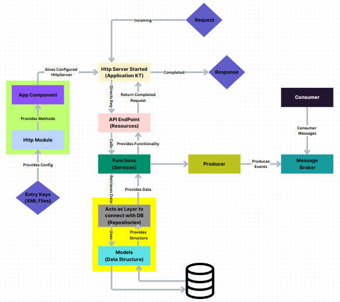

# Project: Documentation for Newly Boarding Members

### XML Files

**What are XML Files?**  
XML (Extensible Markup Language) is a structured format used to store data in a way that both humans and machines can read. In our project, XML files are mainly used to store application settings, like database details, service URLs, and other configurations.

**Why do we need XML files?**  
Instead of hardcoding important values (like database names or server addresses) directly into the code, XML files allow us to separate these configurations. This way, if we need to update or change these values, we only need to edit the XML file instead of modifying the code. This helps in maintaining flexibility and preventing errors in different environments (like production or testing).

---

**Example XML File**:

```xml
<?xml version='1.0' encoding='UTF-8'?>
<properties>
    <!-- Application Configuration -->
    <entry key="registry.manager.app.ip">http://0.0.0.0</entry>
    <entry key="registry.manager.app.port">8087</entry>

    <!-- Database Configuration -->
    <entry key="registry.manager.db.name">registry</entry>
    <entry key="registry.manager.db.host">mongo-registry.databases</entry>
    <entry key="registry.manager.db.port">27017</entry>

    <!-- Service URLs -->
    <entry key="gps.processor.service.url">http://position-processor.streams:2121</entry>
</properties>
```

This XML file contains:
- **Application Configuration**: Stores the IP and port of the application (`registry.manager.app.ip` and `registry.manager.app.port`).
- **Database Configuration**: Defines the database name, host, and port (`registry.manager.db.name`, `registry.manager.db.host`, `registry.manager.db.port`).
- **Service URLs**: Holds the URL for a GPS processor service (`gps.processor.service.url`).

By defining these values in the XML file, you can easily update them without altering your code. If the application server’s IP changes, you just edit the XML file instead of touching the codebase.

---

### XML Overriding

**What is XML Overriding?**  
XML overriding is used when we have multiple environments (like production and testing) that need different settings. For example, your production database might be on a secure cloud server, while your test database could be on your local machine. To handle these differences, we create separate XML files for each environment.

**How does it work?**  
Imagine you have two files: `Production.xml` for your live environment and `Test.xml` for your testing environment. Both files have the same structure, but they contain different values based on the environment they’re used in.

When you run the application in the **production environment**, it will load `Production.xml`, and when you run it in the **testing environment**, it will load `Test.xml`, overriding the settings from the base configuration.

---

**Detailed Example**:

```xml
<!-- Production.xml -->
<properties>
    <entry key="registry.manager.app.ip">http://prod-server.com</entry>
    <entry key="registry.manager.db.host">mongo-prod.databases</entry>
    <entry key="registry.manager.db.port">27017</entry>
</properties>
```

```xml
<!-- Test.xml -->
<properties>
    <entry key="registry.manager.app.ip">http://test-server.com</entry>
    <entry key="registry.manager.db.host">mongo-test.databases</entry>
    <entry key="registry.manager.db.port">27018</entry>
</properties>
```

Let’s break it down:

- **Production.xml**:
  - The application will run using the IP `http://prod-server.com` and connect to the production MongoDB instance located at `mongo-prod.databases` on port `27017`.
  
- **Test.xml**:
  - In the test environment, the application will instead use the IP `http://test-server.com` and connect to the test MongoDB instance at `mongo-test.databases` on port `27018`.

**How does this help?**
- **Easier Environment Management**: You don’t have to change code every time you move between environments. Just select the right XML file for the environment you're in.
- **Safer Deployments**: By keeping production and test settings in separate files, you avoid using test configurations (like a local database) in production by accident.
- **Flexibility**: You can add as many environment-specific XML files as you need, e.g., `Staging.xml`, `Development.xml`, etc.

**Real-Life Example**:  
Imagine a restaurant that offers different menus and services depending on the time of day and the day of the week. Similarly, the application remains the same, but the configuration file changes based on whether it's in production or test mode.

---

## Project Structure

### 1. Dependency Injection (DI) - Example: HTTP Module with GrizzlyServer  
**Dependency Injection (DI)** is a design pattern used to inject dependencies (like services, repositories, or other components) into classes rather than letting the classes create these dependencies themselves. This ensures a decoupled architecture, making it easier to manage and test individual components.

In this project, we use DI to inject the **GrizzlyServer** (HTTP module) and other services into our resource files. When the server starts, it initializes resources (API endpoints), services, repositories, producers, and consumers, all ready to handle incoming requests.

**Example**:  
In a shopping app, each module (user login, product display, checkout) needs different services. DI supplies these modules with the correct services, ensuring they work without having to create these services on their own.

---

### 2. Registering Resources  
**Resources** in the project are entry points for handling incoming HTTP requests. Each resource corresponds to a particular API endpoint (e.g., `/vehicles`, `/users`). Registering resources means mapping URLs to the resource classes that handle requests.

- **Example**:  
  The `VehicleResource` class is registered to handle all requests to the `/vehicles` endpoint. This class processes the request, calls necessary services, and returns the response.

---

### 3. Resource Files  
**Resource files** are responsible for handling the actual requests received at specific API endpoints. They process the requests, pass them to the services for business logic, and return the appropriate response to the client.

- **Example**:  
  - `VehicleResource`: Handles requests for `/vehicles` like fetching vehicle details or adding a new vehicle.
  - `UserResource`: Manages requests to `/users` like user registration and login.

---

### 4. Services  
**Services** contain the core business logic of the application. They execute the required operations, validate data, interact with external systems, and communicate with repositories to fetch or update data.

- **Example**:  
  A `DocumentService` could check if a vehicle’s document is expired. It might also call external APIs (e.g., the mParivahan API) for further validation.

In this project, services can also act as **Producers**, publishing events to a message broker when significant actions occur (e.g., notifying other systems when a vehicle document is validated).

---

### 5. Producer  
**Producers** are components responsible for sending messages to a message broker. For example, after a service processes a request (such as validating a document), it can publish a message to notify other parts of the system or trigger workflows.

- **Example**:  
  A `DocumentService` might publish a message to a message broker (like Kafka or RabbitMQ) that the document has been successfully validated.

---

### 6. Consumer  
**Consumers** listen for messages from the message broker and act on them. For instance, a `DocumentConsumer` could listen for document validation messages and trigger additional workflows based on the content of those messages.

- **Example**:  
  A `NotificationService` could consume messages from the message broker and send out an email or an alert when the document validation is completed.

---

### 7. Repositories  
**Repositories** manage database interactions. They perform operations like retrieving data, updating records, or saving new entities. Services rely on repositories to fetch or save data in the database.

- **Example**:  
  The `VehicleRepository` might handle database queries to fetch vehicle details or insert a new vehicle record.

---

### 8. Model  
**Models** represent the structure of the data in the project. These classes define how data is stored in the database and how it flows between different layers of the system.

- **Example**:  
  The `Vehicle` model would contain fields like `vehicleId`, `registrationNumber`, and `documentExpiryDate`. This model is used by the service and repository layers to handle vehicle data.

---

In this structure:
- The **HttpModule** initializes the application.
- **AppComponent** sets up all dependencies, including the HTTP server, resources, and services.
- The **GrizzlyServer** starts, ready to handle API requests.
- A client makes a request, which is routed through **VehicleResource** to the appropriate service (**DocumentService**).
- **DocumentService** interacts with the **VehicleRepository** and **Vehicle Model** for data operations.
- Once processing is complete, the **DocumentService** (as a **Producer**) sends a message to the **Message Broker**.
- A **Consumer** picks up this message and triggers additional processing, such as notifying the user.

---



