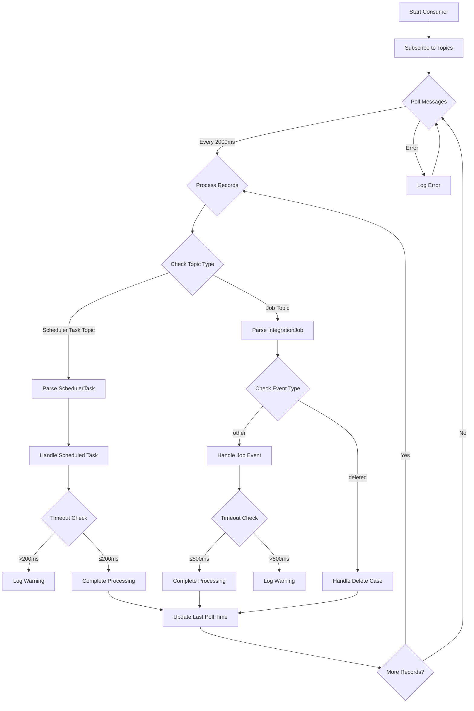

# Logistics Management Application Overview

## Introduction

This document provides an overview of the core components of a logistics management application, focusing on the `LifeCycleManager`, `JobAndSchedulerConsumer`, and `EventHandler`. These components work together to manage job scheduling, processing, and error handling in a Kafka-based architecture.

## 1. LifeCycleManager

### Purpose

The `LifeCycleManager` manages the overall lifecycle of the application. It initializes services, starts the Kafka consumer, schedules jobs, and handles graceful shutdowns.

### Key Responsibilities

- **Start Services**: Initializes and starts necessary services, including the REST server and Kafka consumer.
- **Schedule Jobs**: Registers jobs for execution based on their metadata and handles failure notifications.
- **Stop Services**: Cleans up resources and deregisters scheduled tasks when the application is stopped.

### Important Variables

- **`failCount`**: Tracks how many times a job has failed consecutively. If this count exceeds a threshold, an alert is triggered.
- **`needToSendAlert`**: Indicates whether an alert should be sent for job failures. If `true`, a notification is sent when the job fails a specified number of times.

### Core Methods

- **`start()`**: Initializes the application, starts the server, and schedules jobs based on their metadata.
- **`stop()`**: Deregisters scheduled jobs and cleans up resources, ensuring a graceful shutdown.

### Example Workflow

1. **Startup**: The application starts, and the `LifeCycleManager` initializes services and the Kafka consumer.
2. **Job Scheduling**: Active jobs are retrieved, and their execution intervals are set based on their metadata.
3. **Failure Alerts**: If a job fails, the `failCount` is incremented. If it reaches a threshold, an alert is sent.

---

## 2. JobAndSchedulerConsumer

### Purpose

The `JobAndSchedulerConsumer` listens for messages from Kafka topics that contain job events and scheduled tasks. It processes these messages to ensure that jobs are executed as required.

### Key Responsibilities

- **Consume Messages**: Listens for new messages on the `scheduledTaskTopic` and `jobTopic`.
- **Process Jobs and Tasks**: Deserializes messages and invokes the appropriate logic to handle job events and scheduled tasks.
- **Error Handling**: Catches and logs exceptions that occur during message processing.

### Core Variables

- **`jobTopic`**: The Kafka topic from which job events are consumed.
- **`scheduledTaskTopic`**: The Kafka topic from which scheduled tasks are consumed.
- **`consumer`**: The Kafka consumer instance that polls messages from the specified topics.

### Core Methods

- **`consume()`**: 
  - Subscribes to Kafka topics.
  - Continuously polls for messages.
  - Processes scheduled tasks and job events:
    - **Scheduled Tasks**: Executes tasks based on the received messages.
    - **Job Events**: Handles job creation, updates, and deletions.

### Example Workflow

1. **Message Consumption**: The consumer starts and listens for messages on the specified Kafka topics.
2. **Task Processing**: When a new job event is received, it is deserialized, and the appropriate action is taken (e.g., starting a job, updating a job, or sending an alert for failures).
3. **Error Handling**: Any errors during processing are logged, allowing the application to continue functioning without interruption.

---

## 3. EventHandler

### Purpose

The `EventHandler` is responsible for executing the business logic associated with job events and scheduled tasks. It processes the messages consumed by the `JobAndSchedulerConsumer`.

### Key Responsibilities

- **Handle Job Events**: Processes job creation, updates, and deletions.
- **Execute Scheduled Tasks**: Executes tasks based on the received messages from Kafka.

### Example Cases

1. **Job Creation**:
   - A new job is created and a message is sent to the `jobTopic`.
   - The `JobAndSchedulerConsumer` consumes this message, and the `EventHandler` schedules the job for execution.

2. **Job Failure**:
   - If a job fails, the `failCount` is incremented.
   - If `failCount` exceeds the threshold, `needToSendAlert` is set to `true`, and a failure notification is sent.

3. **Job Update**:
   - When a job's metadata is updated, the `EventHandler` adjusts the scheduling parameters accordingly.
   - If the update involves changing the job's execution interval, the task is rescheduled.

4. **Job Deletion**:
   - If a job is deleted, a message is sent to the `job Topic`.
   - The `EventHandler` processes this message and removes the job from the schedule.

---

## Conclusion

The `LifeCycleManager`, `JobAndSchedulerConsumer`, and `EventHandler` are essential components of the logistics management application, providing robust mechanisms for job scheduling, processing, and error handling. Key variables like `failCount` and `needToSendAlert` help manage job failures effectively, ensuring that alerts are sent when necessary. This design allows the application to operate smoothly in a dynamic environment, adapting to the needs of logistics operations.

If you have any further requests or need additional details, feel free to ask!
