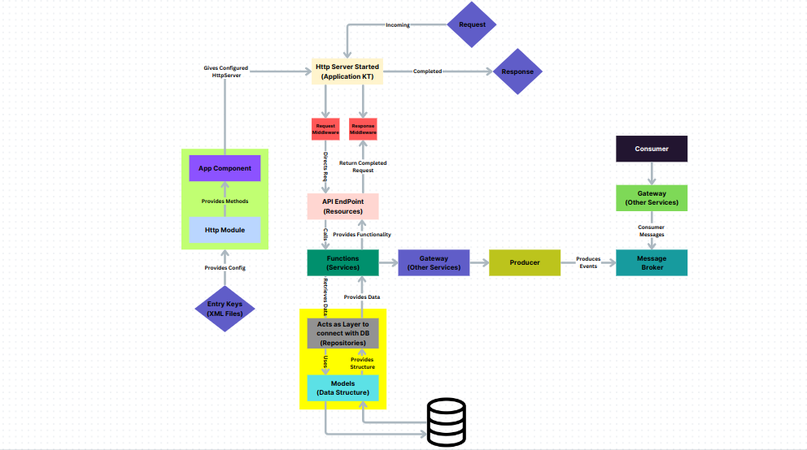

# Project: Documentation for Newly Boarding Members

### XML Files

**What are XML Files?**  
XML (Extensible Markup Language) is a structured format used to store data in a way that both humans and machines can read. In our project, XML files are mainly used to store application settings, like database details, service URLs, and other configurations.

**Why do we need XML files?**  
Instead of hardcoding important values (like database names or server addresses) directly into the code, XML files allow us to separate these configurations. This way, if we need to update or change these values, we only need to edit the XML file instead of modifying the code. This helps in maintaining flexibility and preventing errors in different environments (like production or testing).

---

**Example XML File**:

```xml
<?xml version='1.0' encoding='UTF-8'?>
<properties>
    <!-- Application Configuration -->
    <entry key="registry.manager.app.ip">http://0.0.0.0</entry>
    <entry key="registry.manager.app.port">8087</entry>

    <!-- Database Configuration -->
    <entry key="registry.manager.db.name">registry</entry>
    <entry key="registry.manager.db.host">mongo-registry.databases</entry>
    <entry key="registry.manager.db.port">27017</entry>

    <!-- Service URLs -->
    <entry key="gps.processor.service.url">http://position-processor.streams:2121</entry>
</properties>
```

This XML file contains:
- **Application Configuration**: Stores the IP and port of the application (`registry.manager.app.ip` and `registry.manager.app.port`).
- **Database Configuration**: Defines the database name, host, and port (`registry.manager.db.name`, `registry.manager.db.host`, `registry.manager.db.port`).
- **Service URLs**: Holds the URL for a GPS processor service (`gps.processor.service.url`).

By defining these values in the XML file, you can easily update them without altering your code. If the application server’s IP changes, you just edit the XML file instead of touching the codebase.

---

### XML Overriding

In a project with multiple configuration files, **XML Overriding** ensures that the most specific and relevant configuration is applied, while still allowing for a general set of defaults. This is done by using a hierarchy of configuration files, where more specific configurations override the more general ones. The `.env` file has the **highest priority** and will override all others, if present.

### Hierarchy of Files (from lowest to highest priority):

1. **service.url.xml** (Common for all services and environments)
2. **base.xml** (Common across all environments)
3. **prod.xml** (Specific to the production environment)
4. **test.xml** (Specific to the testing environment)
5. **.env** file (Optional but has the highest priority)

### How the Overriding Works:

1. **General to Specific**:  
   - Configurations defined in **`service.url.xml`** and **`base.xml`** are considered general and are common across multiple environments.
   - As you move down the hierarchy, more environment-specific settings are defined in **`prod.xml`** or **`test.xml`**, which will override any conflicting values in the more general files.
   - Finally, the **`.env` file** has the highest priority and can override any setting defined in the environment-specific XML files (`prod.xml` or `test.xml`).

2. **Overriding by Hierarchy**:  
   If the same configuration setting exists in multiple files, the value in the file with the highest priority (closest to `.env`) will be used.  
   - Example: If both **`test.xml`** and **`.env`** define a value for `service.url`, the value in **`.env`** will override the one in **`test.xml`**.

#### Example:

1. **General Configurations**:  
   The `service.url.xml` file contains configurations common to all environments.  
   Similarly, `base.xml` might define common settings like database host, logging levels, etc.

2. **Environment-Specific Configurations**:  
   - In **production** (`prod.xml`), specific configurations will override general settings in `base.xml` and `service.url.xml`.
   - In **test** (`test.xml`), testing-specific configurations will override those in `base.xml` and `service.url.xml`.

3. **.env Overrides**:  
   The `.env` file, if present, has the **highest priority**. Any value defined in `.env` will override even the environment-specific settings in `prod.xml` or `test.xml`.

---

### How Overriding Works

In a project, both `.env` and `.xml` files are used for configuration, but they follow different naming conventions and formats. The **`.xml` files** use **lowercase words** separated by **dots (.)**, while the **`.env` files** use **uppercase words** separated by **underscores (_)**. For example:
- In `.xml`, a setting might be written as `service.url`.
- In `.env`, the same setting would be written as `SERVICE_URL`.

### Conversion to Hashmaps

Regardless of whether a `.env` file exists, both `.xml` and `.env` file contents are **converted into hashmaps** (key-value pairs) during the application's build process. As part of this conversion, all keys from the `.xml` files are transformed into the **uppercase and underscore** format used by `.env`. For instance, `service.url` in the `.xml` file is converted to `SERVICE_URL` in the hashmap.

Once the conversion is complete, the overriding happens at the **hashmap level**. Each configuration key from the `.xml` or `.env` files is stored in the hashmap, and values from **higher-priority files (like `.env`)** override those from **lower-priority files (like `prod.xml` or `test.xml`)**.

---

## Project Structure

```markdown
# Project Structure

- DI
  - Modules
    - Http
    - Config
    - Mongo
    - Kafka Module
- Resources
  - Providers
- Services
  - Gateways
- Repositories
- Models
- Application.kt
- App Constants
```
---

### Working

1. **XMLs Contain the Configuration**  
   - Store application settings (e.g., database details, API URLs).
   - Include different files for various environments (e.g., `prod.xml`, `test.xml`).

2. **Modules Provide Methods**  
   - **Http Module**: Configures the HTTP server (Grizzly).
   - **Config Module**: Loads configuration from XML and `.env` files.
   - **Mongo Module**: Manages connections to MongoDB.
   - **Kafka Module**: Sets up messaging for producers and consumers.

3. **DaggerAppComponent**  
   - Manages dependency injection across the application.
   - Injects configurations and services into relevant components (resources, services).

4. **Application.kt Starts the Server**  
   - Main entry point of the application.
   - Initializes the server and registers resources for API handling.

---

### Request Flow Through the System

1. **A Request Comes to the HTTP Server**  
   - HTTP server (e.g., Grizzly) receives incoming API requests.

2. **Request Middleware (Providers) Handles Trace ID**  
   - Checks for a Trace ID in the request.
   - If missing, generates a new Trace ID and adds it to the MDC for logging.
   - Trace ID: A unique identifier assigned to each request, used for tracking and logging throughout the system. It allows developers to trace the flow of a request across various components, making debugging and monitoring easier.

3. **Resources Handle Routing**  
   - Routes the request to the appropriate resource (e.g., `VehicleResource` for `/vehicles`).

4. **Services Perform Business Logic**  
   - Services execute core application logic (e.g., validation, calculations).
   - Example: **DocumentService** validates vehicle documents.

5. **Gateways Call External Services**  
   - Services use gateways to interact with third-party APIs (e.g., mParivahan).

6. **Produces and Consumes Data**  
   - Services can act as producers, sending messages to Kafka topics.
   - Other components may act as consumers, processing incoming messages.

7. **Repositories Retrieve Data**  
   - Repositories handle data access and persistence with the database.
   - Abstracts database logic from the services.

8. **Models Define the Data Structure**  
   - Models represent the data format used in the application.
   - Example: **Vehicle model** includes `vehicleId`, `registrationNumber`, etc.

---



