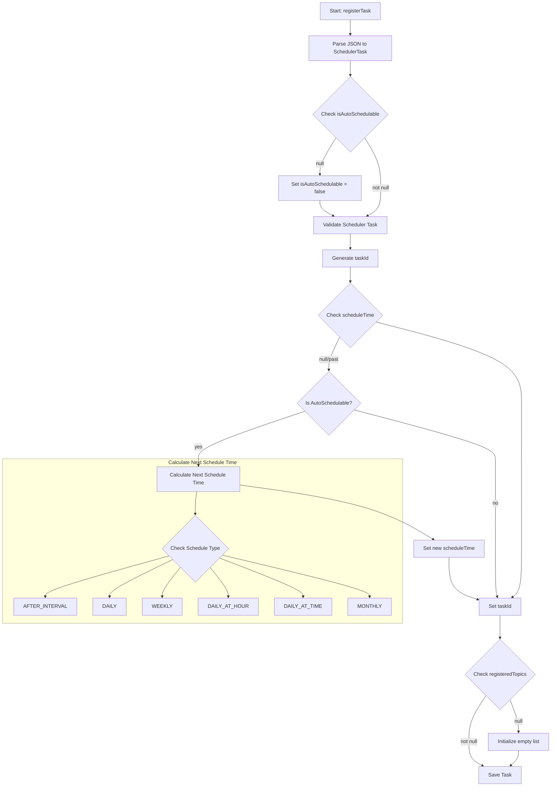
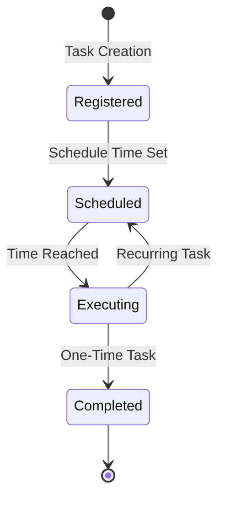

# Scheduler Service Documentation

## Table of Contents
- [1. Service Flow](#1-service-flow)
- [2. Core Concepts](#2-core-concepts)
- [3. Scheduling Patterns](#3-scheduling-patterns)
- [4. State Management](#4-state-management)
- [5. Implementation Guidelines](#5-implementation-guidelines)
- [6. Performance Considerations](#6-performance-considerations)
- [7. Common Use Cases](#7-common-use-cases)

## 1. Service Flow

### 1.1 Task Registration Flow


### 1.2 Task Lifecycle Flow


## 2. Core Concepts

### 2.1 Task Types

#### One-Time Tasks
- Non-repeating tasks with a fixed execution time
- Minimal configuration required
```json
{
    "taskId": "70f54760..._Registry-Manager-Resource_document.expire.action",
    "isAutoSchedulable": false,
    "scheduleTime": 1808937000000
}
```

#### Recurring Tasks
- Automatically rescheduled based on defined patterns
- Requires schedule type and corresponding parameters
```json
{
    "taskId": "a14614b6..._ISSUE_Issue_Summary",
    "isAutoSchedulable": true,
    "scheduleType": "DAILY_AT_HOUR",
    "dayHours": [9]
}
```

### 2.2 Task Identification and Actions
Each task has three core identification components:
```
taskId = ${resourceId}_${resourceType}_${action}
```
**Action Components:**
- **ResourceId**: Unique identifier for the specific resource
- **ResourceType**: Categorization of the resource (e.g., Registry-Manager, ISSUE)
- **Action**: Specifies the precise operation to be performed

**Action Purposes:**
1. Define the exact work to be done for a specific resource
2. Provide granular control over task scheduling and execution
3. Enable unique task identification

**Example formations:**
- Document task: `"70f54760-37fb-4477-8813-641abf1140de_Registry-Manager-Resource_document.expire.action"`
- Report task: `"a14614b6-9f27-4738-b8e9-32bcbc0ddb17_ISSUE_Issue_Summary"`

**Action: Queue After Completion (queue_after_completion)**
- Used in scenarios without an immediate service consumer
- Task lifecycle:
  1. Task is created but cannot be immediately processed
  2. Saved in completed task repository
  3. Timer-based mechanism periodically checks and processes tasks
- Currently implemented for specific resource types (e.g., misreport)

####**ACTION DATA**

**Definition:**
Action Data is a flexible metadata payload that provides additional context or parameters specific to the task's execution requirements. It allows services to include custom information needed to process a task effectively.

**Purpose:**
- Provide service-specific metadata for task execution
- Support dynamic configuration of tasks
- Enable passing additional context without modifying core task structure

**Characteristics:**
- Typically a JSON or key-value structure
- Service-specific and optional
- Can contain complex nested information

**Example Scenarios:**

1. **Document Processing Service**
```json
{
    "taskId": "70f54760-37fb-4477-8813-641abf1140de_Registry-Manager-Resource_document.expire.action",
    "actionData": {
        "documentId": "doc123",
        "expirationPolicy": "archiveAndDelete",
        "notificationEmails": ["admin@example.com"],
        "retentionPeriod": "30d"
    }
}
```

## 3. Scheduling Patterns

### 3.1 Available Schedule Types

#### AFTER_INTERVAL
```kotlin
val intervalTask = SchedulerTask(
    scheduleType = "AFTER_INTERVAL",
    interval = 3600000 // 1 hour in milliseconds
)
```

#### DAILY_AT_HOUR
```kotlin
val dailyTask = SchedulerTask(
    scheduleType = "DAILY_AT_HOUR",
    dayHours = listOf(9, 15) // 9 AM and 3 PM
)
```

#### WEEKLY
```kotlin
val weeklyTask = SchedulerTask(
    scheduleType = "WEEKLY",
    weekDays = listOf(1, 3, 5), // Mon, Wed, Fri
    timeOfDay = 32400000 // 9 AM in milliseconds
)
```

#### MONTHLY
```kotlin
val monthlyTask = SchedulerTask(
    scheduleType = "MONTHLY",
    datesOfMonth = listOf(1, 15), // 1st and 15th
    timesOfDay = listOf(32400000) // 9 AM
)
```

### Schedule Type Impacts

1. **AFTER_INTERVAL**
   - Required: `interval`
   - Impact: Task reschedules after fixed interval
   - Next Schedule = currentScheduleTime + interval

2. **DAILY**
   - Required: `timeOfDay`
   - Impact: Executes daily at specified time
   - Rolls over to next day if current time is past

3. **WEEKLY**
   - Required: `weekDays`, `timeOfDay`
   - Impact: Executes on specified days at given time
   - Calculates next occurrence based on current weekday

4. **DAILY_AT_HOUR**
   - Required: `dayHours`
   - Impact: Multiple executions per day at specified hours
   - Sorts hours for sequential execution

5. **DAILY_AT_TIME**
   - Required: `timesOfDay`
   - Impact: Multiple executions at specific times daily
   - Sorts times for sequential execution

6. **MONTHLY**
   - Required: `datesOfMonth`, `timesOfDay`
   - Impact: Executes on specified dates at given times
   - Handles month rollover

### Validation Rules

1. **Auto-schedulable Tasks**
   - Must have valid `scheduleType`
   - Must have required properties for chosen type
   - Validates schedule-specific parameters

2. **Non-auto-schedulable Tasks**
   - Must have valid `scheduleTime`
   - No additional scheduling parameters required
